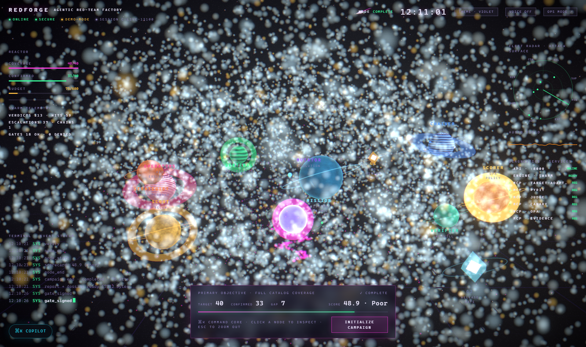
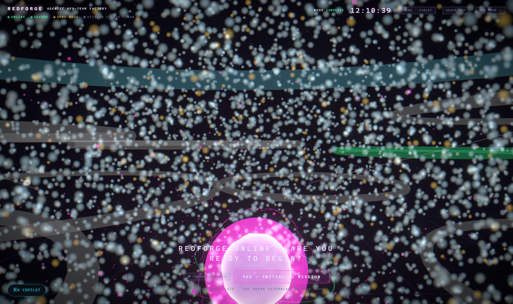
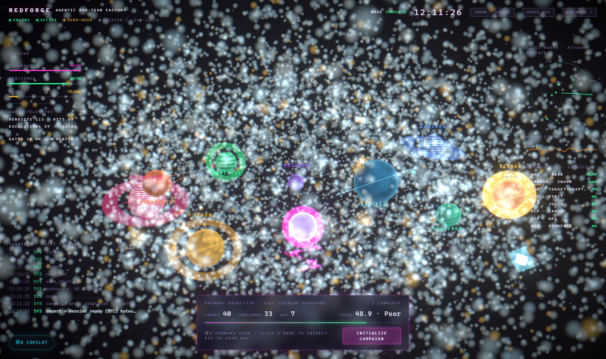

# RedForge — Agentic AI Red-Team Factory

**An autonomous red-team swarm that attacks LLM agent systems, adjudicates every attempt with a dual-mode judge, proves impact with canaries, and produces an audit-grade security dossier — all observable from a cinematic "World View" console.**

    



## What this is

RedForge runs a **9-agent attack pipeline + 2 human gates** (11 runtime swarm nodes) against an LLM-driven target, end to end:

- **40 attack techniques** across 8 packs — `PIN` prompt injection, `EXF` exfiltration, `OUT` unsafe output, `AGE` agentic escalation, `MEM` memory poisoning, `CON` context manipulation, `HAL` hallucination, `SUP` shadow-tool abuse (OWASP LLM / MITRE ATLAS mapped)
- **Dual-mode judging** per attempt — deterministic rule detectors fused with an LLM judge (demo stub until keys are added), single-writer verdict combine, escalation to humans
- **Canary-proven exfiltration** — seeded tokens + local webhook detector; a finding only says "exfiltrated" if a canary actually fired
- **Bounded evolution** — ≤3 mutation rounds with marginal-gain cutoff, hard budget caps (attempts / tokens / USD)
- **Human gates** — G1 (two-person rule before dangerous techniques) and G2 (release gate), countersigned in the UI
- **OPA-scored posture** — 6-dimension security scorecard computed by real Rego (Python fallback), weights per blueprint
- **Audit-grade reporting** — every report claim cites a finding id; citation lint, compliance mapping (EU AI Act / ISO 42001), markdown + PDF dossier
- **Evidence ledger** — SQLite store of findings/transcripts/verdicts with a FP-kill verifier

## The World View console

The console ships two experiences on one live SSE stream:

- **Ops Mode** (`/`) — dense, audit-grade: mission DAG, transcripts, findings explorer, gatekeeper console, scorecard, regulatory dossier, technique library, target registry (10 screens)
- **World View** (`/world`) — the screen *is* a 3D world: the **Orchestrator** (a humanoid head assembled from ~12k molecules, featureless by design) asks if you're ready, then **summons his agents as distinct planets** — a banded gas giant for the operators, a tilted ice world for the judge, a golden star for the scorer. Campaigns play out as physics: pulses ride the links, verdicts ripple, gates flare, handoffs stream packets across blinking lines — while diegetic instruments (reactor gauges, fleet radar, audio waveform, MCP diagnostics, typewriter terminal, glass objective banner) float over the scene. Rockets and meteoroids cross the sky. Voice (keyless Web Speech) + ⌘K command core included.

 

## Quickstart

Prerequisites: **Python 3.12+**, **Node 18+**, **[uv](https://docs.astral.sh/uv/)** (recommended). Optional: OPA binary for real Rego scoring (a Python fallback is built in). No LLM API keys needed — RedForge is **demo-first** (decision D3): it attacks a bundled *vulnerable demo copilot* and the LLM judge runs as a deterministic stub. Add real keys later via `.env` to unlock live-LLM attack mode.

Versioning: `release.toml` is the single source of truth (`0.8.0` + codename `m8-ritual` → Python `0.8.0+m8.ritual`, npm `0.8.0-m8-ritual`). Run `python scripts/verify_versions.py` to check drift.

```bash
# 1) engine (reproducible lock)
uv sync --group dev                # uses uv.lock; or: pip install -e ".[dev]"

# 2) Live API  (:8000)
python -m uvicorn redforge.api.server:app --host 127.0.0.1 --port 8000

# 3) console   (:3100)
cd console
npm ci                           # reproducible from package-lock.json
npm run build && npm run start -- -p 3100

# 4) open the world
#    http://localhost:3100/world        (ritual boot → YES → mission control)
#    http://localhost:3100/             (ops mode)
```

Headless verification of everything:

```bash
python -m pytest tests/ -q              # 165+ tests (4 optional skips without PyRIT/OPA)
python scripts/verify_versions.py      # release.toml drift guard
python scripts/run_gates.py             # 14 milestone gates + pass rate
python scripts/e2e_console.py           # full campaign driven through the World View UI (Playwright)
python scripts/run_e2e.py               # headless CLI end-to-end campaign

# Opt-in live Astra judge smoke (paid Azure — never CI):
RF_LIVE_ASTRA=1 python -m pytest -m live_astra -v
python scripts/smoke_astra.py
```

## Repo layout

```
redforge/            the engine package
  schemas/           finding / transcript / verdict / campaign models
  contracts/         40 flaw specs + tool registries (documented vs shadow)
  catalog/           techniques + seeds, packs, targets, scorecard model
  targets/           vulnerable demo copilot + adapters
  judge/             rule detectors + LLM judge + verdict combine
  scoring/           scorecard engine, severity matrix, OPA/Rego runner
  canary/            canary minting, webhook listener, proof
  evidence/          sqlite evidence store + verifier
  swarm/             9-agent campaign engine + G1/G2 gates + bounded mutator
  reporting/         compliance controls, citation lint, PDF renderer
  mcp_servers/       6 P0 MCP servers (target-adapter, pyrit, judge, canary, opa, evidence)
  api/               Live API: SSE event bus, gates, findings, report
console/             Next.js 15 console (ops mode + world view, react-three-fiber)
scripts/             gates runner, CLI e2e, console e2e
tests/               147 tests incl. real-uvicorn SSE suite
docs/                blueprint workbook, project memory, screenshots
```

## MCP-first surface

Six MCP servers expose the factory to agents and IDEs: `demo_chat` / `call_target_tool` (attack the target), seed corpora + PyRIT import, `judge_attempt`, canary mint/prove, OPA scorecard + severity, evidence store queries. Register them from `redforge/mcp_servers/README.md`.

## Deferred by design

- **Real LLM keys** — drop into `.env` and flip the provider to activate live-LLM attacks and the LLM half of judging
- **Docker** — optional; SQLite/filesystem substitutions are built in (decision D4)

## License

MIT — see [LICENSE](LICENSE).
